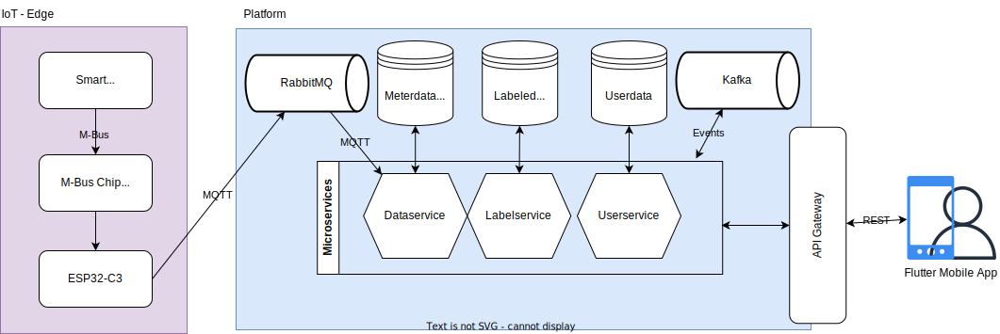

# Platform Architecture

#### by [Jakob Feistenauer](https://github.com/yescob) & [Marcel Nague](https://github.com/marcel-nague)

Detailed overview of the architecture of the Layblar Platform

## System Architecture

## Domain Model

<!--  -->

## Services and System Operations

| Service              | System Operation                                          | Collaborators                                                                                                |
| -------------------- | --------------------------------------------------------- | ------------------------------------------------------------------------------------------------------------ |
| UserService          | [createUser()](#createuser)                               | <ul><li>UserService::createHousehold()</li></ul>                                                             |
| UserService          | [loginUser()](#loginuser)                                 | <ul><li>UserService::verifyUser()</li></ul>                                                                  |
| UserService          | [logoutUser()](#logoutuser)                                 | <ul><li>UserService::verifyUser()</li></ul>                                                                  |
| UserService          | [joinHousehold()](#joinhousehold)                         | <ul><li>UserService::verifyUser()</li><li>UserService::mergeHouseholds()</li></ul>                           |
| UserService          | [leaveHousehold()](#leavehousehold)                       | <ul><li>UserService::verifyUser()</li><li>UserService::splitHouseholds()</li></ul>                           |
| UserService          | [getHouseholdInformation()](#gethouseholdinformation)     | <ul><li>UserService::verifyUser()</li></ul>                                                                  |
| UserService          | [addDeviceToHousehold()](#adddevicetohousehold)           | <ul><li>UserService::verifyUser()</li><li>DeviceLibraryService::addDeviceInformation()</li></ul>             |
| UserService          | [updateDeviceInformation()](#updatedeviceinformation)     | <ul><li>UserService::verifyUser()</li><li>DeviceLibraryService::updateDeviceInformation()</li></ul>          |
| UserService          | [removeDeviceFromHousehold()](#removedevicefromhousehold) | <ul><li>UserService::verifyUser()</li></ul>                                                                  |
| UserService          | [listHouseholdDevices()](#listhouseholddevices)           | <ul><li>UserService::verifyUser()</li><li>DeviceLibraryService::findDeviceInformation()</li></ul>            |
| UserService          | [registerSmartMeterReader()](#registersmartmeterreader)   | <ul><li>UserService::verifyUser()</li><li>SmartMeterService::addNewSmartMeter()</li></ul>                    |
| UserService          | [removeSmartMeterReader()](#removesmartmeterreader)       | <ul><li>UserService::verifyUser()</li><li>SmartMeterService::removeSmartMeter()</li></ul>                    |
| SmartMeterService    | [getSmartMeterData()](#getsmartmeterdata)                 | <ul><li>UserService::verifyUser()</li></ul>                                                                  |
| ProjectService       | [createResearcher()](#createresearcher)                   |                                                                                                              |
| ProjectService       | [createProject()](#createproject)                         | <ul><li>ProjectService:verifyResearcher()</li></ul>                                                          |
| ProjectService       | [updateProjectInformation()](#updateprojectinformation)   | <ul><li>ProjectService:verifyResearcher()</li><li>ProjectService:verifyProjectInformationDetails()</li></ul> |
| ProjectService       | [updateProjectSettings()](#updateprojectsettings)         | <ul><li>ProjectService:verifyResearcher()</li><li>ProjectService:verifyProjectSettingsDetails()</li></ul>    |
| ProjectService       | [listProjects()](#listprojects)                           | <ul><li>UserService::verifyUser()</li><li>UserService::verifyResearcher()</li></ul>                          |
| ProjectService       | [joinProject()](#joinproject)                             | <ul><li>UserService::verifyUser()</li></ul>                                                                  |
| ProjectService       | [getProjectInformation()](#getprojectinformation)         | <ul><li>UserService::verifyUser()</li></ul>                                                                  |
| LabelService         | [getProjectLabels()](#getprojectlabels)                   | <ul><li>UserService::verifyUser()</li></ul>                                                                  |
| LabelService         | [createLabel()](#createlabel)                             | <ul><li>UserService::verifyUser()</li><li>DeviceLibraryService::findDeviceInformation()</li></ul>            |
| DeviceLibraryService | [listDevices()](#listdevices)                             |                                                                                                              |

## Create User {createuser}

**Description** : Create a new user.

**Operation** : createUser()

**Returns** : Household Information

**Preconditions** :

- None

**Postconditions** :

- A new user was successfully created.
- A new household was successfully created.
- The new user is part of the new household

**Collaborators** :

## Login User {loginuser}

**Description** : Allow a user to log in.

**Operation** : loginUser()

**Returns** : Authentication token

**Preconditions** :

- User exists and is part of a household.

**Postconditions** :

- The user is authenticated and logged in.

**Collaborators** :

## Logout User {logoutuser}

**Description** : Allow a user to log out.

**Operation** : logoutUser()

**Returns** : Success status

**Preconditions** :

- User is logged in with a valid token.

**Postconditions** :

- The user is logged out and the token deleted.

**Collaborators** :

## Join Household {joinhousehold}

**Description** : Allow a user to join a household.

**Operation** : joinHousehold()

**Returns** : Success status

**Preconditions** :

- User verification is successful.
- The household to be joined exists.
- Merging households, if necessary, is successful.

**Postconditions** :

- The user has joined the household.

**Collaborators** :

- UserService::verifyUser()
- UserService::mergeHouseholds()

## Leave Household {leavehousehold}

**Description** : Allow a user to leave a household.

**Operation** : leaveHousehold()

**Returns** : Success status

**Preconditions** :

- User verification is successful.
- The user is a member of a household.
- Splitting households, if necessary, is successful.

**Postconditions** :

- The user has left the household.

**Collaborators** :

- UserService::verifyUser()
- UserService::splitHouseholds()

## Get Household Information {gethouseholdinformation}

**Description** : Retrieve information about a user's household.

**Operation** : getHouseholdInformation()

**Returns** : Household information

**Preconditions** :

- User verification is successful.

**Postconditions** :

- Household information is retrieved.

**Collaborators** :

- UserService::verifyUser()

## Add Device to Household {adddevicetohousehold}

**Description** : Add a device to a household.

**Operation** : addDeviceToHousehold()

**Returns** : Success status

**Preconditions** :

- User verification is successful.
- Device information is provided and valid.

**Postconditions** :

- The device is added to the household.
- The device information is added to the device library.

**Collaborators** :

- UserService::verifyUser()
- DeviceLibraryService::addDeviceInformation()

## Update Device Information {updatedeviceinformation}

**Description** : Update information about a device in a household.

**Operation** : updateDeviceInformation()

**Returns** : Success status

**Preconditions** :

- User verification is successful.
- Device information is provided and valid.

**Postconditions** :

- The device information is updated.
- The device information is updated in the device library.

**Collaborators** :

- UserService::verifyUser()
- DeviceLibraryService::updateDeviceInformation()

## Remove Device from Household {removedevicefromhousehold}

**Description** : Remove a device from a household.

**Operation** : removeDeviceFromHousehold()

**Returns** : Success status

**Preconditions** :

- User verification is successful.

**Postconditions** :

- The device is removed from the household.

**Collaborators** :

- UserService::verifyUser()

## List Household Devices {listhouseholddevices}

**Description** : Retrieve a list of devices in a household.

**Operation** : listHouseholdDevices()

**Returns** : List of devices

**Preconditions** :

- User verification is successful.

**Postconditions** :

- A list of devices in the household is retrieved.

**Collaborators** :

- UserService::verifyUser()
- DeviceLibraryService::findDeviceInformation()

## Register Smart Meter Reader {registersmartmeterreader}

**Description** : Register a smart meter reader for a user.

**Operation** : registerSmartMeterReader()

**Returns** : Success status

**Preconditions** :

- User verification is successful.

**Postconditions** :

- The smart meter reader is registered.

**Collaborators** :

- UserService::verifyUser()
- SmartMeterService::addNewSmartMeter()

## Remove Smart Meter Reader {removesmartmeterreader}

**Description** : Remove a registered smart meter reader.

**Operation** : removeSmartMeterReader()

**Returns** : Success status

**Preconditions** :

- User verification is successful.

**Postconditions** :

- The smart meter reader is removed.

**Collaborators** :

- UserService::verifyUser()
- SmartMeterService::removeSmartMeter()

## Get Smart Meter Data {getsmartmeterdata}

**Description** : Retrieve smart meter data.

**Operation** : getSmartMeterData()

**Returns** : Smart meter data

**Preconditions** :

- User verification is successful.

**Postconditions** :

- Smart meter data is retrieved.

**Collaborators** :

- UserService::verifyUser()

## Create Researcher {createresearcher}

**Description** : Create a new researcher.

**Operation** : createResearcher()

**Returns** : Researcher ID

**Preconditions** :

- None

**Postconditions** :

- A new researcher was successfully created.

**Collaborators** :

## Create Project {createproject}

**Description** : Create a new project.

**Operation** : createProject()

**Returns** : Project ID

**Preconditions** :

- Researcher verification is successful.

**Postconditions** :

- A new project was successfully created.

**Collaborators** :

- ProjectService:verifyResearcher()

## Update Project Information {updateprojectinformation}

**Description** : Update project information.

**Operation** : updateProjectInformation()

**Returns** : Success status

**Preconditions** :

- Researcher verification is successful.
- Project information details are provided and valid.

**Postconditions** :

- Project information is updated.

**Collaborators** :

- ProjectService:verifyResearcher()
- ProjectService:verifyProjectInformationDetails()

## Update Project Settings {updateprojectsettings}

**Description** : Update project settings.

**Operation** : updateProjectSettings()

**Returns** : Success status

**Preconditions** :

- Researcher verification is successful.
- Project settings details are provided and valid.

**Postconditions** :

- Project settings are updated.

**Collaborators** :

- ProjectService:verifyResearcher()
- ProjectService:verifyProjectSettingsDetails()

## List Projects {listprojects}

**Description** : Retrieve a list of projects.

**Operation** : listProjects()

**Returns** : List of projects

**Preconditions** :

- User verification is successful.
- Researcher verification is successful.

**Postconditions** :

- A list of projects is retrieved.

**Collaborators** :

- UserService::verifyUser()
- UserService::verifyResearcher()

## Join Project {joinproject}

**Description** : Allow a user to join a project.

**Operation** : joinProject()

**Returns** : Success status

**Preconditions** :

- User verification is successful.

**Postconditions** :

- The user has joined the project.

**Collaborators** :

- UserService::verifyUser()

## Get Project Information {getprojectinformation}

**Description** : Retrieve project information.

**Operation** : getProjectInformation()

**Returns** : Project information

**Preconditions** :

- User verification is successful.

**Postconditions** :

- Project information is retrieved.

**Collaborators** :

- UserService::verifyUser()

## Get Project Labels {getprojectlabels}

**Description** : Retrieve project labels.

**Operation** : getProjectLabels()

**Returns** : Project labels

**Preconditions** :

- User verification is successful.

**Postconditions** :

- Project labels are retrieved.

**Collaborators** :

- UserService::verifyUser()

## Create Label {createlabel}

**Description** : Create a label.

**Operation** : createLabel()

**Returns** : Success status

**Preconditions** :

- User verification is successful.
- Device information is provided and valid.

**Postconditions** :

- A labeled dataset is created.

**Collaborators** :

- UserService::verifyUser()
- DeviceLibraryService::findDeviceInformation()

## List Devices {listdevices}

**Description** : List available devices.

**Operation** : listDevices()

**Returns** : List of devices

**Preconditions** :

- None

**Postconditions** :

- A list of available devices is retrieved.

**Collaborators** :
