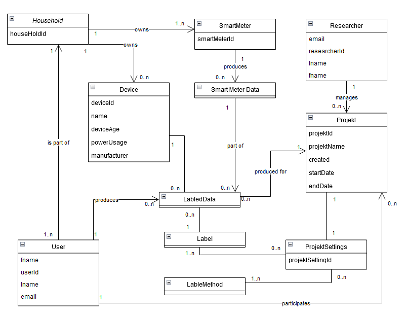

# Platform Architecture

#### by [Jakob Feistenauer](https://github.com/yescob) & [Marcel Nague](https://github.com/marcel-nague)

Detailed overview of the architecture of the Layblar Platform

## Domain Model

<!--  -->

## Services and System Operations

| Service              | System Operation                                             | Collaborators                                                                                               |
| -------------------- | ------------------------------------------------------------ | ----------------------------------------------------------------------------------------------------------- |
| UserService          | [createUser()](#create-user)                                 | <ul><li>UserService::createHousehold()</li><ul>                                                             |
| UserService          | [loginUser()](#login-user)                                   | <ul><li>UserService::verifyUser()</li><ul>                                                                  |
| UserService          | [joinHousehold()](#join-household)                           | <ul><li>UserService::verifyUser()</li><li>UserService::mergeHouseholds()</li><ul>                           |
| UserService          | [leaveHousehold()](#leave-household)                         | <ul><li>UserService::verifyUser()</li><li>UserService::splitHouseholds()</li><ul>                           |
| UserService          | [getHouseholdInformation()](#get-household-information)             | <ul><li>UserService::verifyUser()</li><ul>                                                                  |
| UserService          | [addDeviceToHousehold()](#add-device-to-household)           | <ul><li>UserService::verifyUser()</li><li>DeviceLibraryService::addDeviceInformation()</li><ul>             |
| UserService          | [updateDeviceInformation()](#update-device-information)      | <ul><li>UserService::verifyUser()</li><li>DeviceLibraryService::updateDeviceInformation()</li><ul>          |
| UserService          | [removeDeviceFromHousehold()](#remove-device-from-household) | <ul><li>UserService::verifyUser()</li><ul>                                                                  |
| UserService          | [listHouseholdDevices()](#list-household-devices)            | <ul><li>UserService::verifyUser()</li><li>DeviceLibraryService::findDeviceInformation()</li><ul>            |
| UserService          | [registerSmartMeterReader()](#register-smart-meter-reader)   | <ul><li>UserService::verifyUser()</li><li>SmartMeterService::addNewSmartMeter()</li><ul>                    |
| UserService          | [removeSmartMeterReader()](#remove-smart-meter-reader)       | <ul><li>UserService::verifyUser()</li><li>SmartMeterService::removeSmartMeter()</li><ul>                    |
| SmartMeterService    | [getSmartMeterData()](#get-smart-meter-data)                 | <ul><li>UserService::verifyUser()</li><ul>                                                                  |
| ProjectService       | [createResearcher()](#create-researcher)                     |                                                                                                             |
| ProjectService       | [createProject()](#create-project)                           | <ul><li>ProjectService:verifyResearcher()</li><ul>                                                          |
| ProjectService       | [updateProjectInformation()](#update-project-information)    | <ul><li>ProjectService:verifyResearcher()</li><li>ProjectService:verifyProjectInformationDetails()</li><ul> |
| ProjectService       | [updateProjectSettings()](#update-project-settings)          | <ul><li>ProjectService:verifyResearcher()</li><li>ProjectService:verifyProjectSettingsDetails()</li><ul>    |
| ProjectService       | [listProjects()](#list-projects)                             | <ul><li>UserService::verifyUser()</li><li>UserService::verifyResearcher()</li><ul>                          |
| ProjectService       | [joinProject()](#join-project)                               | <ul><li>UserService::verifyUser()</li><ul>                                                                  |
| ProjectService       | [getProjectInformation()](#get-project-information)          | <ul><li>UserService::verifyUser()</li><ul>                                                                  |
| LabelService         | [getProjectLabels()](#get-project-labels)                    | <ul><li>UserService::verifyUser()</li><ul>                                                                  |
| LabelService         | [createLabel()](#create-label)                                     | <ul><li>UserService::verifyUser()</li><li>DeviceLibraryService::findDeviceInformation()</li><ul>            |
| DeviceLibraryService | [listDevices()](#list-devices)                               |                                                                                                             |

## Create User

**Description** : Create a new user.

**Operation** : createUser()

**Returns** : Household Information

**Preconditions** :

-   None

**Postconditions** :

-   A new user was successfully created.
-   A new household was successfully created.
-   The new user is part of the new household

**Collaborators** :

## Login User

**Description** : Allow a user to log in.

**Operation** : loginUser()

**Returns** : Authentication token

**Preconditions** :

-   User exists and is part of a household.

**Postconditions** :

-   The user is authenticated and logged in.

**Collaborators** :

## Join Household

**Description** : Allow a user to join a household.

**Operation** : joinHousehold()

**Returns** : Success status

**Preconditions** :

-   User verification is successful.
-   The household to be joined exists.
-   Merging households, if necessary, is successful.

**Postconditions** :

-   The user has joined the household.

**Collaborators** :

-   UserService::verifyUser()
-   UserService::mergeHouseholds()

## Leave Household

**Description** : Allow a user to leave a household.

**Operation** : leaveHousehold()

**Returns** : Success status

**Preconditions** :

-   User verification is successful.
-   The user is a member of a household.
-   Splitting households, if necessary, is successful.

**Postconditions** :

-   The user has left the household.

**Collaborators** :

-   UserService::verifyUser()
-   UserService::splitHouseholds()

## Get Household Information

**Description** : Retrieve information about a user's household.

**Operation** : getHouseholdInformation()

**Returns** : Household information

**Preconditions** :

-   User verification is successful.

**Postconditions** :

-   Household information is retrieved.

**Collaborators** :

-   UserService::verifyUser()

## Add Device to Household

**Description** : Add a device to a household.

**Operation** : addDeviceToHousehold()

**Returns** : Success status

**Preconditions** :

-   User verification is successful.
-   Device information is provided and valid.

**Postconditions** :

-   The device is added to the household.
-   The device information is added to the device library.

**Collaborators** :

-   UserService::verifyUser()
-   DeviceLibraryService::addDeviceInformation()

## Update Device Information

**Description** : Update information about a device in a household.

**Operation** : updateDeviceInformation()

**Returns** : Success status

**Preconditions** :

-   User verification is successful.
-   Device information is provided and valid.

**Postconditions** :

-   The device information is updated.
-   The device information is updated in the device library.

**Collaborators** :

-   UserService::verifyUser()
-   DeviceLibraryService::updateDeviceInformation()

## Remove Device from Household

**Description** : Remove a device from a household.

**Operation** : removeDeviceFromHousehold()

**Returns** : Success status

**Preconditions** :

-   User verification is successful.

**Postconditions** :

-   The device is removed from the household.

**Collaborators** :

-   UserService::verifyUser()

## List Household Devices

**Description** : Retrieve a list of devices in a household.

**Operation** : listHouseholdDevices()

**Returns** : List of devices

**Preconditions** :

-   User verification is successful.

**Postconditions** :

-   A list of devices in the household is retrieved.

**Collaborators** :

-   UserService::verifyUser()
-   DeviceLibraryService::findDeviceInformation()

## Register Smart Meter Reader

**Description** : Register a smart meter reader for a user.

**Operation** : registerSmartMeterReader()

**Returns** : Success status

**Preconditions** :

-   User verification is successful.

**Postconditions** :

-   The smart meter reader is registered.

**Collaborators** :

-   UserService::verifyUser()
-   SmartMeterService::addNewSmartMeter()

## Remove Smart Meter Reader

**Description** : Remove a registered smart meter reader.

**Operation** : removeSmartMeterReader()

**Returns** : Success status

**Preconditions** :

-   User verification is successful.

**Postconditions** :

-   The smart meter reader is removed.

**Collaborators** :

-   UserService::verifyUser()
-   SmartMeterService::removeSmartMeter()

## Get Smart Meter Data

**Description** : Retrieve smart meter data.

**Operation** : getSmartMeterData()

**Returns** : Smart meter data

**Preconditions** :

-   User verification is successful.

**Postconditions** :

-   Smart meter data is retrieved.

**Collaborators** :

-   UserService::verifyUser()

## Create Researcher

**Description** : Create a new researcher.

**Operation** : createResearcher()

**Returns** : Researcher ID

**Preconditions** :

-   None

**Postconditions** :

-   A new researcher was successfully created.

**Collaborators** :

## Create Project

**Description** : Create a new project.

**Operation** : createProject()

**Returns** : Project ID

**Preconditions** :

-   Researcher verification is successful.

**Postconditions** :

-   A new project was successfully created.

**Collaborators** :

-   ProjectService:verifyResearcher()

## Update Project Information

**Description** : Update project information.

**Operation** : updateProjectInformation()

**Returns** : Success status

**Preconditions** :

-   Researcher verification is successful.
-   Project information details are provided and valid.

**Postconditions** :

-   Project information is updated.

**Collaborators** :

-   ProjectService:verifyResearcher()
-   ProjectService:verifyProjectInformationDetails()

## Update Project Settings

**Description** : Update project settings.

**Operation** : updateProjectSettings()

**Returns** : Success status

**Preconditions** :

-   Researcher verification is successful.
-   Project settings details are provided and valid.

**Postconditions** :

-   Project settings are updated.

**Collaborators** :

-   ProjectService:verifyResearcher()
-   ProjectService:verifyProjectSettingsDetails()

## List Projects

**Description** : Retrieve a list of projects.

**Operation** : listProjects()

**Returns** : List of projects

**Preconditions** :

-   User verification is successful.
-   Researcher verification is successful.

**Postconditions** :

-   A list of projects is retrieved.

**Collaborators** :

-   UserService::verifyUser()
-   UserService::verifyResearcher()

## Join Project

**Description** : Allow a user to join a project.

**Operation** : joinProject()

**Returns** : Success status

**Preconditions** :

-   User verification is successful.

**Postconditions** :

-   The user has joined the project.

**Collaborators** :

-   UserService::verifyUser()

## Get Project Information

**Description** : Retrieve project information.

**Operation** : getProjectInformation()

**Returns** : Project information

**Preconditions** :

-   User verification is successful.

**Postconditions** :

-   Project information is retrieved.

**Collaborators** :

-   UserService::verifyUser()

## Get Project Labels

**Description** : Retrieve project labels.

**Operation** : getProjectLabels()

**Returns** : Project labels

**Preconditions** :

-   User verification is successful.

**Postconditions** :

-   Project labels are retrieved.

**Collaborators** :

-   UserService::verifyUser()

## Create Label

**Description** : Create a label.

**Operation** : createLabel()

**Returns** : Success status

**Preconditions** :

-   User verification is successful.
-   Device information is provided and valid.

**Postconditions** :

-   A labeled dataset is created.

**Collaborators** :

-   UserService::verifyUser()
-   DeviceLibraryService::findDeviceInformation()

## List Devices

**Description** : List available devices.

**Operation** : listDevices()

**Returns** : List of devices

**Preconditions** :

-   None

**Postconditions** :

-   A list of available devices is retrieved.

**Collaborators** :
