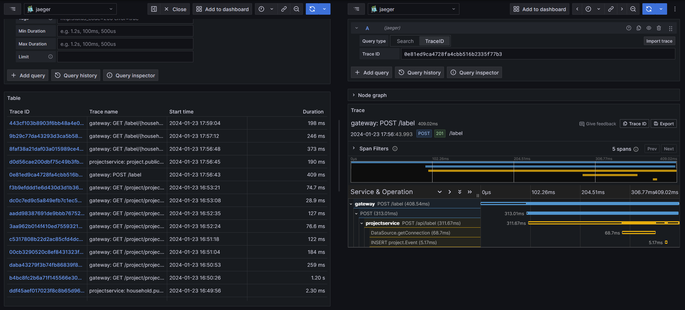

# Monitoring

__by [Jakob Feistenauer](https://github.com/yescob)__

## Introduction

The services of the layblar platfrom expose metrics and traces that can be collected by Jaeger and Prometheus and displayed with Grafana.

## Enabling Tracing

Ensure that the following lines are added to the `build.gradle` file of a service.

```gradle
    implementation("io.quarkus:quarkus-opentelemetry")
    implementation("io.opentelemetry.instrumentation:opentelemetry-jdbc")
```

To enable tracing for database transaction ensure that the following configuration property is set:

```properties
quarkus.datasource.jdbc.telemetry=true
```

For more information on tracing refer to the Quarkus guide: <https://quarkus.io/guides/opentelemetry>

## Enabling Metrics

Ensure that the following lines are added to the `build.gradle` file of a service.

```gradle
    implementation("io.quarkus:quarkus-micrometer-registry-prometheus")
```

For more information on exposing metrics refer to the Quarkus guide: <https://quarkus.io/guides/telemetry-micrometer>

## Starting the Monitoring Services

The setup for the monitoring services is contained in the [`monitoring.yaml`](https://github.com/Layblar/platform/tree/main/deployment/monitoring.yaml) in the [`deployment`](https://github.com/Layblar/platform/tree/main/deployment) folder.

The configuration for Prometheus is found in the prometheus.yaml.

```yaml
global:
  scrape_interval: 15s
  external_labels:
    monitor: 'layblar-monitor'

scrape_configs:
  - job_name: 'prometheus'
    static_configs:
      - targets: ['localhost:9090']
  - job_name: 'layblar'
    metrics_path: /q/metrics
    static_configs:
      - targets: ['gateway:8080', 'layblar-household-service:8080', 'layblar-smart-meter-service:8080', 'layblar-project-service:8080' , 'layblar-device-library-service:8080']
```

__NOTE__: We used the addresses of the layblar-network. You may need to change the target addresses depending where your Prometheus service is running.

## Setting up Grafana

Grafana-UI can be accessed on port :3000.

Default credentials are `admin` `admin`.

To collect data you need to add a datasource for Prometheus and for Jaeger.


For displaying the metrics collected by Prometheus we used this [Dashboard](https://grafana.com/grafana/dashboards/14370-jvm-quarkus-micrometer-metrics/) as a template.

To view the traces collected by Jaeger select the datasource and click on `Explore data` in the top right corner.

